<style>
body {
  background: white none;
  text-align: center;
}

ul,
.editor {
  text-align: left;
}
</style>

# Revitalising your frontend workflow with Pattern libraries
<br><br>
Andy Mantell

TechExeter 2016

------

# Hello!


Freelance frontend developer

Dabbles in Node.JS, Python, fun things

Doesn't normally take selfies


------


------

# Anyway....
Let's go on a journey through frontend development
------


You're given a set of Photoshop files for a site you've got to build. What do you do?

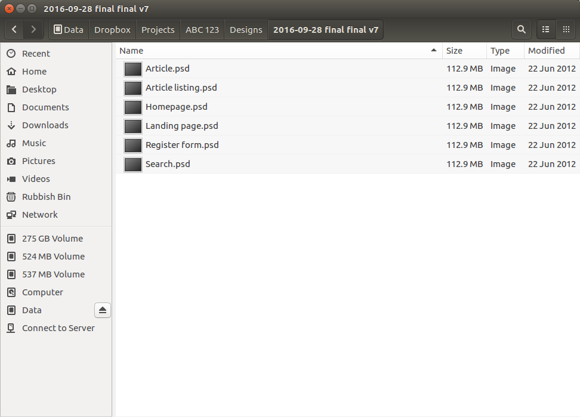


------

# 2006

Start at the top of the homepage and work down, writing HTML, CSS and JS in one big pile of spaghetti.

------

# 2007
* Write all the HTML and _then_ write the CSS because you want to nail the ultimate separation of concerns?
* Write some JavaScript to fix the rounded corners in IE6

```js
// Fix bug where, in ie6, absolutely positioned corners
// do not align correctly with bottom right corner of
// parent container when the height/width is an odd number
case 'corner':
  if($bIE6) {
    if(divs[i].parentNode.clientHeight%2){
      divs[i].style.bottom = -2 + 'px';
    }
    if(divs[i].parentNode.clientWidth%2){
      divs[i].style.right = -2 + 'px';
    }
  }
break;
```


------

# 2008

OMG jQuery. Let's put transitions on EVERYTHING
<br><br>
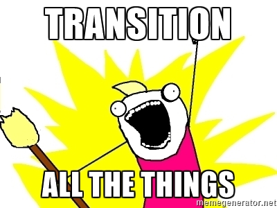

------

# 2010

All my classes *must* be "semantic".

Death to presentational classes.

SASS `@extend` everything!

_Hellooo 1mb stylesheet_

------

# 2011
* Bootstrap!
* Shoehorn it into Bootstrap because that'll save me time right?

------

# Whatever
## You picked an approach and ran with it.

------

# Perfection
## It was awesome to start with. It was the Right Way.

------

# Done
## A few weeks later you've had to do a bit of bodging.
## But that won't happen again. Next time will be different

------

# :shipit:
## You send it to the backend team and move on. Life is good.

------

# Cue trainwreck

------

# What happened?
## Your work was great, where did it go wrong?

------

## You built what you saw, but not what was "meant"
## A snapshot
## A spaghetti monster
<br><br>
## And then you threw it over the wall

------

# Step in: pattern libraries
- Style guides
- Component libraries
- Design systems

------

# So what is one? What's the point?


------

# Self contained patterns promote abstraction, modularity and re-use
- Re-use across projects, between teams
- Discipline and focus

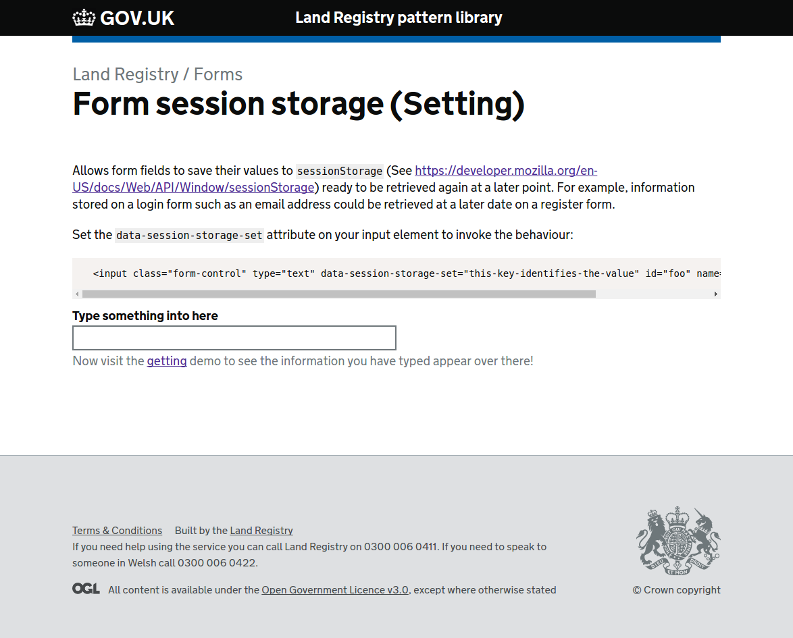

------

# Testable
- Small testable pieces with clear single purposes
- Provides confidence
- Isolated from your main application(s)

```js
client
  .url('http://localhost:3000/form-session-storage/set/')
  .setValue('#demo-field', value)
  .url('http://localhost:3000/form-session-storage/get/')
  .getValue('#demo-field')
  .then(function(text) {
    text.should.be.equal(value)
  })
  .getValue('#demo-field-2')
  .then(function(text) {
    text.should.be.equal("This is a prefilled value, it won't get blown away by the value in sessionStorage")
  })
  .getValue('#demo-field-3')
  .then(function(text) {
    text.should.be.equal(value)
  })
```

------

# Demo pages promote documentation by default
- Handover to backend developers easier


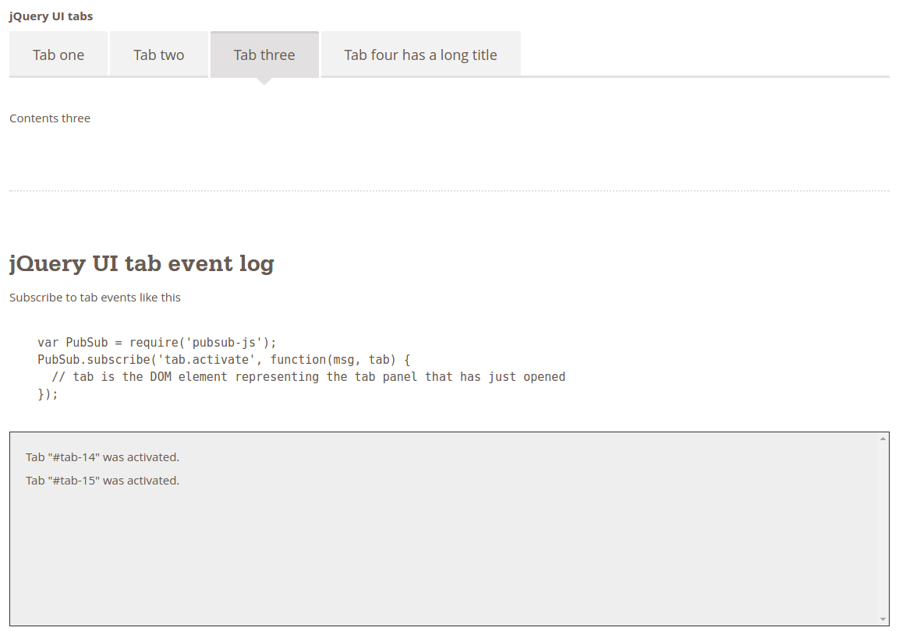


------

# Modularity enables parallel development
- Namepsaced CSS scope (Consider adopting a naming convention which promotes this such as [BEM](http://slides.andymantell.com/digpen-7-modular-and-maintainable-frontends/?full#17))
- Modular JavaScript (E.g. ES6 or CommonJS modules via Browserify, Webpack)
- Physically seperate on disk - no merge conflicts
- Less stepping on each others toes

------
# Modularity enables parallel development


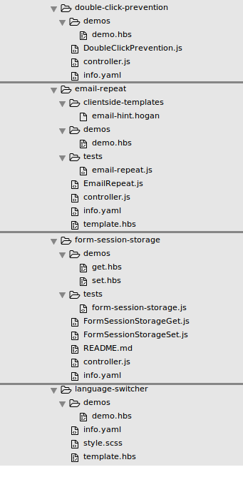


------

# Visual regression testing
- Nip issues in the bud by implementing visual regression testing in a stable environment (As opposed to your production app)
- Instant visibility of conflicts with other components
- Allows developers to work confidently without intimate knowledge of every component

------

# Visual regression testing
## Reference rendering


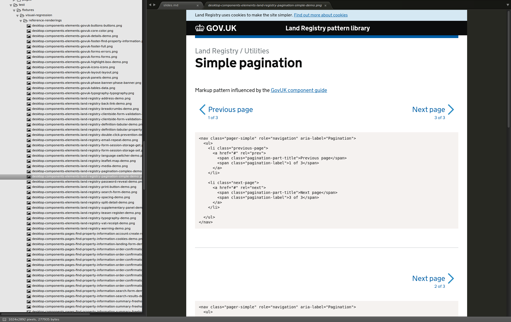


------

# Visual regression testing
## Write some naughty code!

```css
ul > li span {
  border-bottom: 2px dotted #333;
}
```

------

# Visual regression testing
## TravisCI fails the build


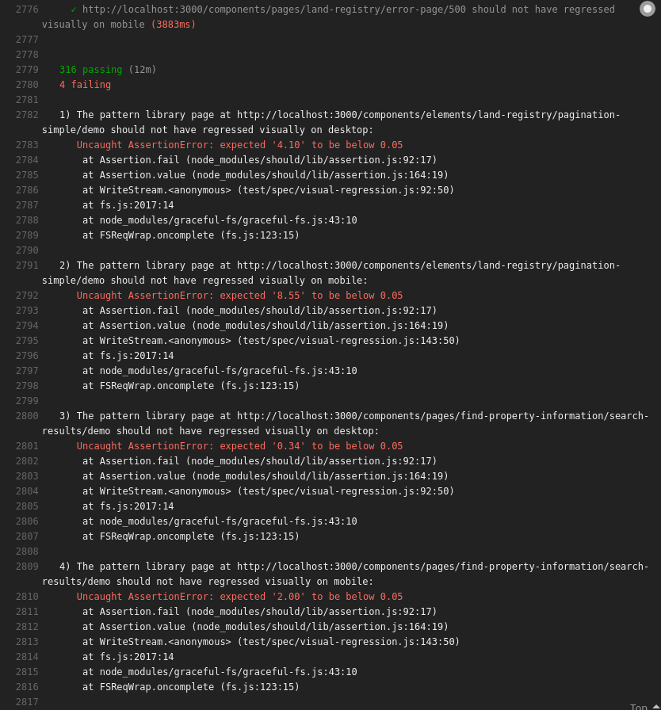


------

# Visual regression testing
## Resulting diff of the problem


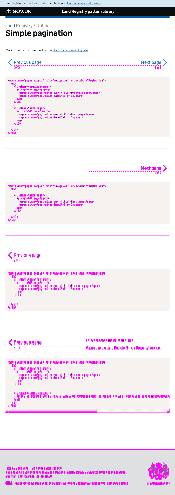


------

# Visual regression testing
## Acknowledge intentional changes


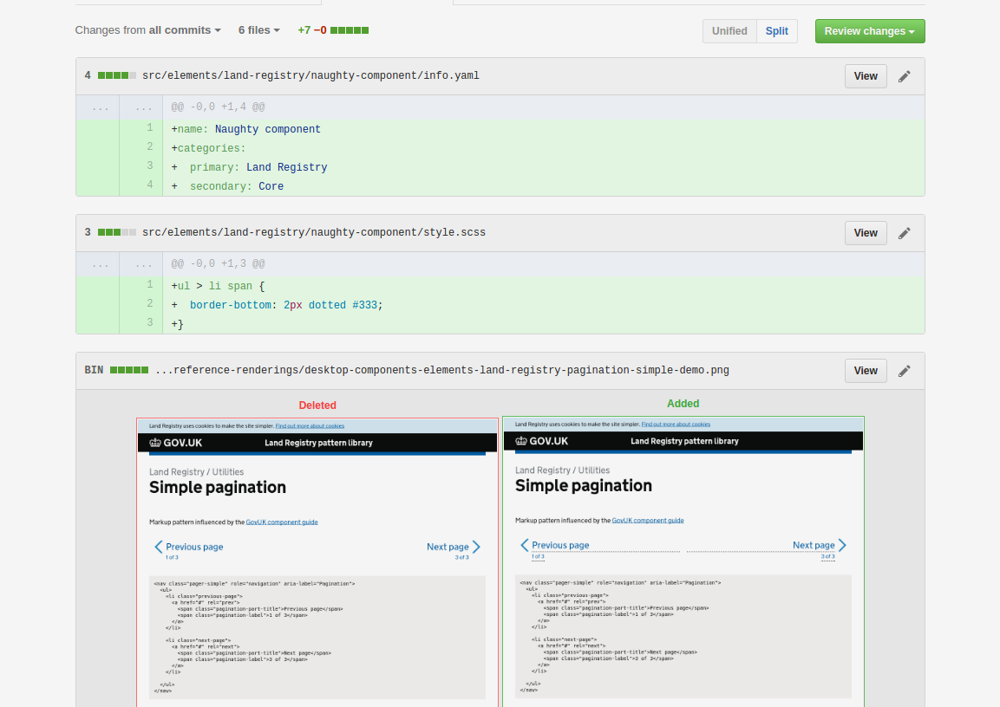


------

# Ok I'm in, how do I go about it?
A range of methods, some more radical than others.

The list is vast (See http://styleguides.io/tools.html and https://github.com/davidhund/styleguide-generators)

I'm just going to pick a few...

------

# Knyle Style Sheets
https://github.com/kneath/kss
Parses documentation embedded in your CSS / Sass in order to automatically generate a styleguide.
Relatively easy to integrate with an existing workflow.

```css

// Buttons
//
// A majority of buttons in the site are built from the same base class.
//
// Markup: buttons.hbs
//
// .primary   - Use this class to indicate that the button is the primary
//              feature of this form.
// .remove    - Use this class to indicate that the button will remove a
//              feature, or other negative connotations.
// :hover     - Highlight the button when hovered.
// :disabled  - Make the button change appearance to reflect it being disabled.
// :active    - "Press" the button down when clicked.
//
// Style guide: demo.components.buttons
.button {
  ...
}

```

------

# Knyle Style Sheets
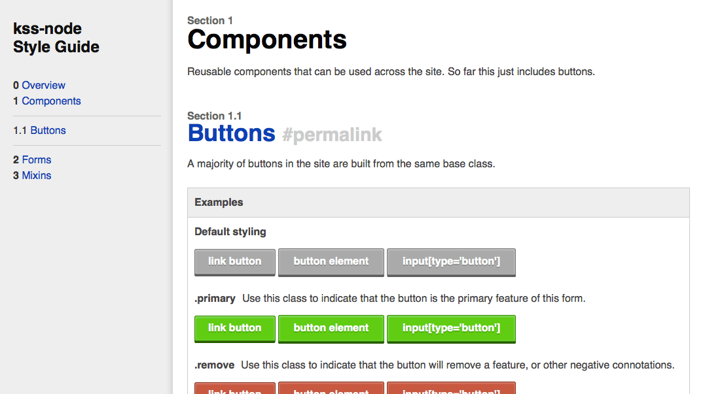

------

# Fractal
http://fractal.build/
Powerful pattern library generator that also has a built in build tool.
Good fit for new projects and the ability to generate your production assets _using your pattern library_ is a great feature.

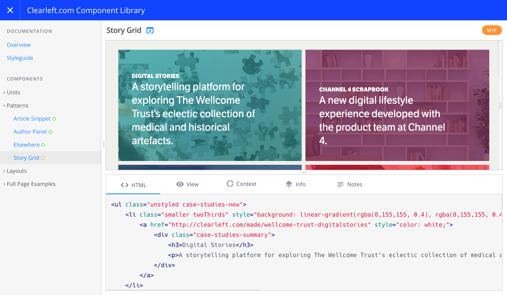
------

# Build your own!
There's a wide range of these tools, but not all of them are mature and only a small subset will likely fit the way you want to work.
It's a young enough ecosystem that building your own is not necessarily a sin.

```js
app.get('/components/*/:variant', function(req, res){
  Promise
    .all([
      handlebars(),
      components.getComponent(req.params[0])
    ])
    .spread(function(hbs, component) {
      var variant = component.variants[req.params.variant];
      var context = extend(variant.context, {component: component});

      renderPage(hbs, {
        title: variant.name,
        content: hbs.compile(variant.content)(variant.context),
        pageData: variant.context.pageData
      })
      .then(function(html) {
        res.send(html);
      });
    })
```

------

# Hang on
You've invested time and built some fancypants thing, but isn't the original problem still there? We're still throwing stuff over the fence...

------

# Living style guides
Requires a lot of discipline - but the key is to integrate the style guide into your build process somewhere
- A Grunt / Gulp build step?
- Custom npm script

The code which generates your pattern library must _be_ the code that generates your production assets.

------

## Show and tell: Land Registry Elements


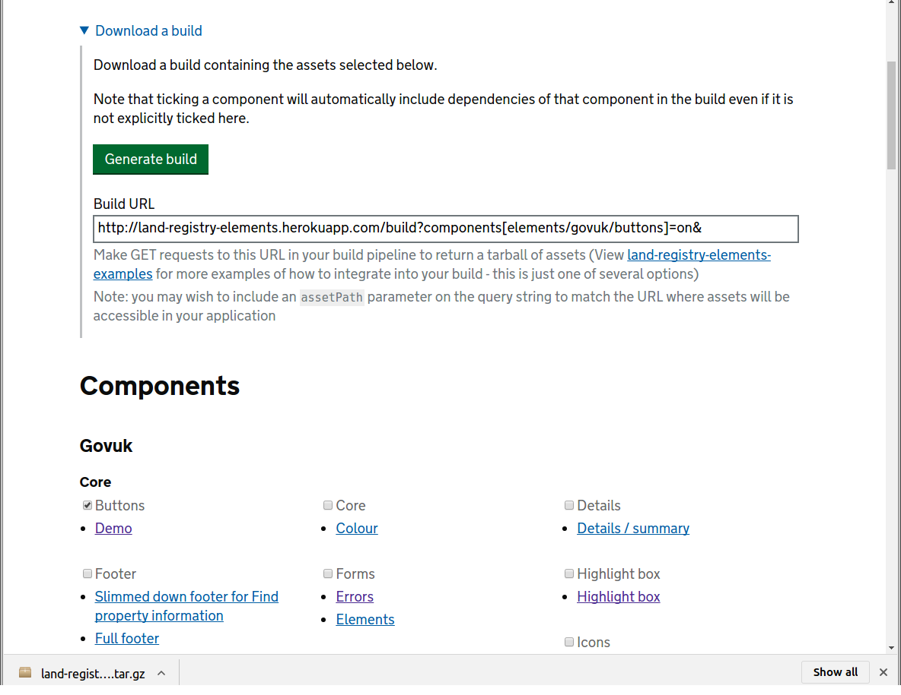


------

## Show and tell: Land Registry Elements

```js
var path = require('path');
var landRegistryElements = require('land-registry-elements');

landRegistryElements({
  'mode': 'production',
  'destination': path.resolve(__dirname, 'service/ui/.land-registry-elements'),
  'components': [
    'pages/find-property-information/search-form',
    'pages/find-property-information/search-results',
    'pages/find-property-information/order-confirmation',
    'pages/find-property-information/summary',
    'pages/find-property-information/cookies',
    'pages/find-property-information/account/create',
    'pages/land-registry/error-page'
  ]
})
  .then(function(dest) {
    console.log('Done');
  })
  .catch(function(e) {
    console.error(e);
  });
```

------

## Land Registry Elements - possible future plans
- Currently in use on one Land Registry Gov.uk service - potential to be rolled out to more
- Decouple from Gov.uk to facilitate use on Land Registry internal systems
- Decouple the build tool from the components

------

## Land Registry Elements - learnings
- Complexity! Care needed when designing tooling - how long would it take you to remove the tooling entirely?
- Yet another thing for developers to learn
- Visual regression testing is hard!
- Process slows down the flow of patterns from HTML prototypes to production, but in a _good_ way! Prototypes rarely production ready.
- Pattern library sometimes falls behind - best intentions sometimes squashed by time constraints

------

# Where to go from here?
- Split components out into individual repositories? Complete modularity.
- Web Components? (One day...)
- Provide templates from the pattern library - integrate these into the production app?

------

# Homework
- http://styleguides.io
- https://css-tricks.com/design-systems-building-future/
- http://danielmall.com/articles/content-display-patterns/

------

# Questions
