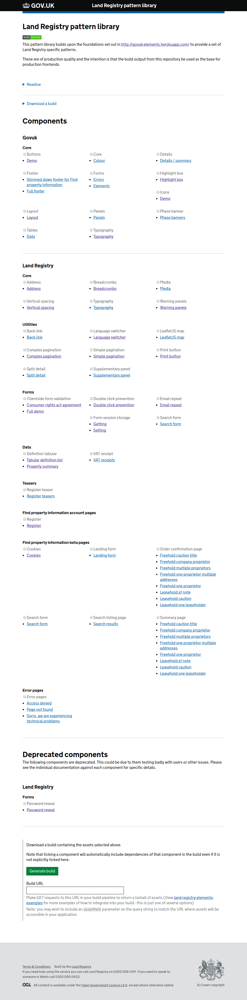

# Revitalising your frontend workflow with Pattern libraries
<br><br>
<center>Andy Mantell</center>
<center>TechExeter 2016</center>

------

# Hello!
<center>


</center>

------

<center>


</center>

------

# Anyway....
Let's go on a journey through frontend development
------

<center>
You're given a set of Photoshop files for a site you've got to build. What do you do?


</center>

------

# 2006

* Start at the top of the homepage and work down, writing HTML, CSS and JS in one big go?

------

# 2007
* Write all the HTML and _then_ write the CSS because you want to nail the ultimate separation of concerns?
* Write some JavaScript to fix the rounded corners in IE6

```js
// Fix bug where, in ie6, absolutely positioned corners
// do not align correctly with bottom right corner of
// parent container when the height/width is an odd number
case 'corner':
  if($bIE6) {
    if(divs[i].parentNode.clientHeight%2){
      divs[i].style.bottom = -2 + 'px';
    }
    if(divs[i].parentNode.clientWidth%2){
      divs[i].style.right = -2 + 'px';
    }
  }
break;

```

<center>


</center>

------

# 2011
* Bootstrap!
* Shoehorn it into Bootstrap because that'll save me time right?
* Let's put jQuery transitions on EVERYTHING

------

# Whatever
## You picked an approach and ran with it.

------

# Perfection
## It was awesome to start with. It was the Right Way.

------

# Done
## A few weeks later you've had to do a bit of bodging.
## But that won't happen again. Next time will be different

------

# :shipit:
## You send it to the backend team and move on. Life is good.

------

# Cue trainwreck

------

# What happened?
## Your work was great, where did it go wrong?

------

# You built what you saw, but not what was "meant"
# A snapshot
# A spaghetti monster

------

# Step in: pattern libraries
## AKA:
- Style guides
- Component libraries
- Design systems

_and probably various others terms_

------

# So what is one? What's the point?

<center>



</center>

------

# Self contained patterns promote abstraction, modularity and re-use
- Re-use across projects, between teams


------

# Testable
- Small testable pieces with clear single purposes
- Provides confidence
- Isolated from your main application(s)

```js
client
  .url('http://localhost:3000/components/elements/land-registry/form-session-storage/set/')
  .setValue('#demo-field', value)
  .url('http://localhost:3000/components/elements/land-registry/form-session-storage/get/')
  .getValue('#demo-field')
  .then(function(text) {
    text.should.be.equal(value)
  })
  .getValue('#demo-field-2')
  .then(function(text) {
    text.should.be.equal("This is a prefilled value, it won't get blown away by the value in sessionStorage")
  })
  .getValue('#demo-field-3')
  .then(function(text) {
    text.should.be.equal(value)
  })
```

------

# Demo pages promote documentation by default
- Handover to backend developers easier
- Future maintenance is simpler


------

# Modularity enables parallel development
- Less stepping on each others toes
- _Caveat: Requires discipline with CSS naming conventions such as BEM. Am not referring to locally namespaced selectors like WebComponents_

------

# Visual regression testing
- Nip issues in the bud by implementing visual regression testing
- Instant visibility of conflicts with other components
- Allows developers to work confidently without intimate knowledge of every component

------

# How should I go about it?
A range of methods, some more radical than others.
The list is vast (See http://styleguides.io/tools.html / https://github.com/davidhund/styleguide-generators), I'm just going to pick a few

------

# Knyle Style Sheets
https://github.com/kneath/kss
Parses documentation embedded in your CSS / Sass in order to automatically generate a styleguide.
Relatively easy to integrate with an existing workflow.

------

# Fractal
http://fractal.build/
Powerful pattern library generator that also has a built in build tool.
Good fit for new projects and the ability to generate your production assets _using your pattern library_ is a great feature.

------

# Build your own!
There's a wide range of these tools, but not all of them are mature and only a small subset will likely fit the way you want to work.
It's a young enough ecosystem that building your own is not necessarily a sin.

------

## Show and tell: Land Registry Elements
Built on top of Gov.uk elements
Components in a custom format using a YAML file to define dependencies
Web frontend has a built in build tool accessible via an HTTP API
Or pattern library can be `npm install`ed and built out into a project.
Visual regression testing in place to prevent conflicts between teams

------

## Land Registry Elements - possible future plans
- Currently in use on a Gov.uk service - potential to be rolled out to more
- Decouple from Gov.uk to facilitate use on Land Registry internal systems
- Decouple the build tool from the components

------

## Land Registry Elements - learnings
- Complexity! Not everyone is a frontend dev - care needed when designing tooling
- Visual regression testing is hard!
- Process slows down the flow of patterns from HTML prototypes to production, but in a _good_ way! Prototypes rarely production ready.

------

# Pitfalls and learnings
- Pattern library falls behind - best intentions sometimes fall squashed by time constraints
- Keep on top of tech debt (**photo of unofficial postit note backlog**)

------

# Where to go from here
- Split components out into individual repositories? Complete modularity.
- Web Components? (One day...)
- Provide templates from the pattern library - integrate these into a production app?

------

# Homework
- http://styleguides.io
- https://css-tricks.com/design-systems-building-future/
- http://danielmall.com/articles/content-display-patterns/
